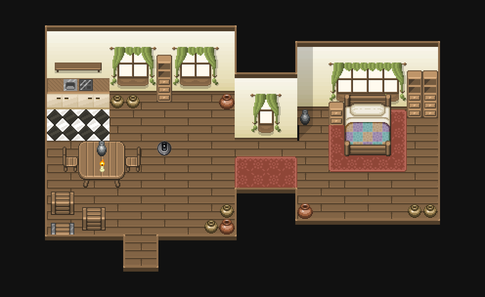

# Influencing Behavioral Attributions to Robot Motion

The resources you'd need to understand and model the high-level behavioral attributions people make to a robot's motion (like, "curious" or "broken") as it does a task. 

In order of how you'd use the resources:

* A gridworld environment styled to portray a robot vacuum cleaner
* Python modules for planning coverage trajectories in the environment
* Amazon Mechanical Turk interfaces we used to collect attributions to trajectories
* Trajectory featurizer, implemented to capture user-identified salient aspects of the motion 
* Mixture density network model code (PyTorch) for learning to predict attributions to trajectories
* Search-based optimization procedure for generating trajectories that elicit a desired attribution while balancing task completion

You can read a full description of how we used these elements in ["Influencing Behavioral Attributions to Robot Motion During Task Execution."](https://nickwalker.us/publications/walker2021attributions)

If you find this code useful, consider citing the paper:

BibTeX

<pre>
@inproceedings{walker2021attributions,
  author = {Walker, Nick and Mavrogiannis, Christoforos and Srinivasa, Siddhartha and Cakmak, Maya},
  title = {Influencing Behavioral Attributions to Robot Motion During Task Execution},
  booktitle = {Conference on Robot Learning (CoRL)},
  location = {London, UK},
  month = nov,
  year = {2021}
}
</pre>

